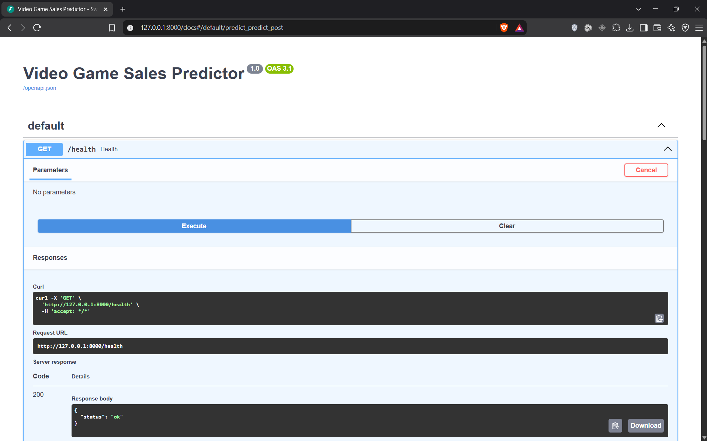
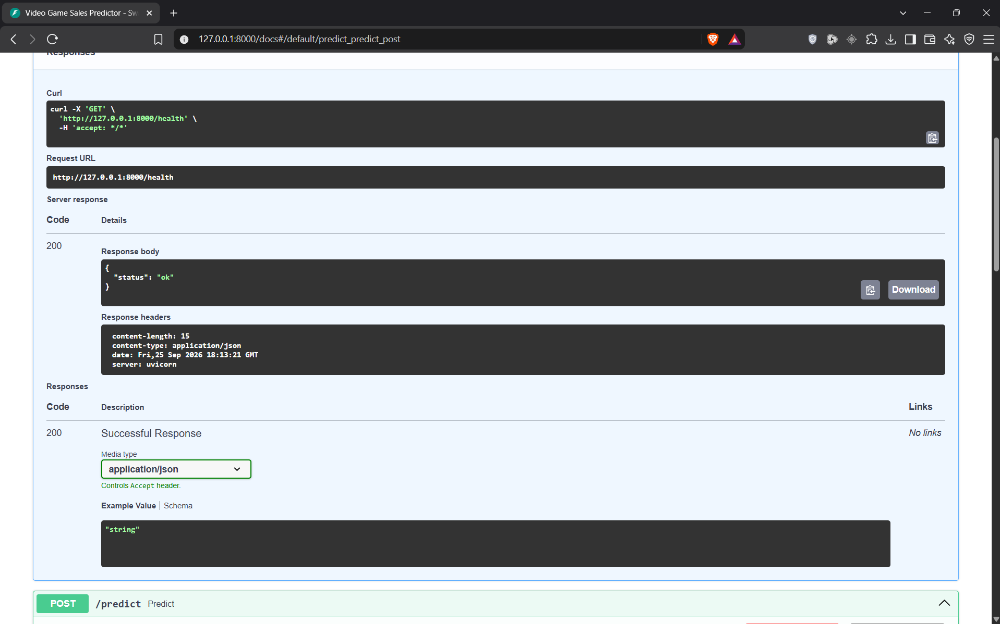
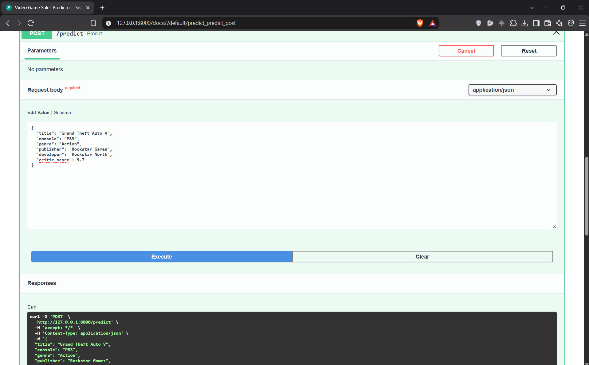
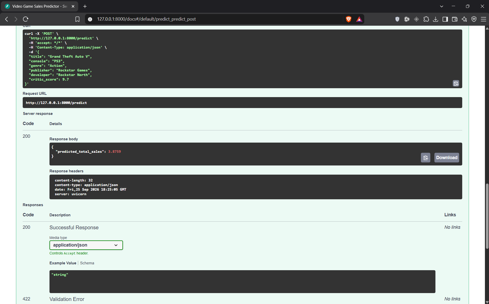

# Video Game Sales Predictor

## 📌 Project Overview

This project uses Machine Learning to predict the **total sales of video games** based on historical information such as critic scores, console, genre, publisher, developer, and title characteristics.

The project follows an end-to-end Data Science workflow:

**Data → Data Cleaning → Missing Value Handling → Feature Engineering → Feature Selection → Model Training → Model Comparison → Model Saving → FastAPI → Docker**

The trained machine learning model is deployed as a REST API using **FastAPI** and containerized using **Docker**.

---

## 🎯 Objective

The main objective is to predict the total sales of a video game using information available about the game.

The model predicts:

* **Predicted Total Sales** — Estimated total sales of the video game.

This type of predictive system demonstrates how machine learning can be used to analyze historical video game data and estimate sales based on available game information.

---

## 📊 Dataset

The project uses a video game sales dataset containing information about video games, their platforms, genres, publishers, developers, critic scores, sales, and release information.

### Important Features

| Feature | Meaning |
| ------ | ------- |
| `title` | Title of the video game |
| `console` | Gaming platform/console |
| `genre` | Genre of the game |
| `publisher` | Game publisher |
| `developer` | Game developer |
| `critic_score` | Critic rating of the game |
| `total_sales` | Total sales of the game |
| `release_date` | Original release date |
| `last_update` | Last update information |

The dataset also contains regional sales features:

```text
na_sales
jp_sales
pal_sales
other_sales
```

These features were not used for prediction because they are components of `total_sales` and would cause target leakage.

---

## 🔎 Data Preprocessing

The following preprocessing steps were performed:

### 1. Missing Value Handling

Missing values were analyzed during the Exploratory Data Analysis phase.

Categorical missing values were handled using:

```text
Unknown
```

Missing `critic_score` values were handled using the median calculated from the training data.

Historical feature missing values were replaced with:

```text
0
```

### 2. Duplicate Removal

Duplicate records were identified and removed during preprocessing.

### 3. Date Processing

The `release_date` column was converted into datetime format.

Additional date features were created:

```text
release_year
release_month
release_quarter
```

### 4. Title Feature Engineering

Additional features were created from the game title:

```text
title_length
title_word_count
```

### 5. Categorical Encoding

The `genre` feature was encoded using:

```python
OneHotEncoder()
```

The encoder was fitted using the training data.

### 6. Console Frequency Encoding

The `console` feature was converted into a frequency-based numerical feature using frequencies calculated from the training data.

### 7. Historical Features

Historical publisher and developer features were created:

```text
publisher_avg_sales
publisher_previous_games
developer_avg_sales
developer_previous_games
```

These features use historical information to represent previous publisher and developer performance.

---

## 🤖 Machine Learning Model

Several regression approaches were evaluated during model development.

The models evaluated were:

```text
Dummy Regressor
Linear Regression
Polynomial Regression
Ridge Regression
Lasso Regression
```

The models were evaluated using:

```text
MAE
MSE
RMSE
R² Score
```

The final production model is:

```text
Polynomial Regression
```

with:

```text
Polynomial Degree = 2
```

The final model was selected based on its performance on the unseen test dataset.

---

## 📈 Model Evaluation

The models were evaluated using an unseen chronological test dataset.

### Model Comparison

| Model | RMSE | R² Score |
| ------ | ----: | -------: |
| Dummy Regressor | 1.0663 | -0.0058 |
| Linear Regression | 0.9979 | 0.1191 |
| Ridge Regression | 0.9979 | 0.1191 |
| Lasso Regression | 1.0001 | 0.1153 |
| Polynomial Regression | **0.9350** | **0.2266** |

### Final Model Performance

```text
MAE  = 0.3057
MSE  = 0.8743
RMSE = 0.9350
R²   = 0.2266
```

The model achieved an R² score of **0.2266**, meaning that the selected features explain approximately **22.7% of the variation** in total video game sales.

Other factors not available in the dataset may also influence video game sales.

---

## 🧠 Feature Selection

Feature selection was performed using:

```python
SelectKBest(score_func=f_regression)
```

The top features were selected using the training data.

The selected feature count was:

```text
15
```

Feature selection was performed before feature scaling and model training.

---

## 📏 Feature Scaling

The selected features were standardized using:

```python
StandardScaler()
```

The scaler was fitted using the training data and then applied to the testing data.

This ensures that information from the test dataset is not used during the scaling process.

---

## ⏳ Time-Aware Train-Test Split

A chronological train-test split was used for model evaluation.

Earlier game records were used for training, while later records were reserved for testing.

This approach helps simulate a real-world prediction scenario where historical information is used to predict future observations.

Regional sales features were excluded from the predictors because they are components of the target variable `total_sales`.

---

## 💾 Model Saving

The complete model and preprocessing artifacts were saved using `joblib`.

The saved model contains:

```python
{
    "model": poly_model,
    "poly": poly,
    "selector": selector,
    "scaler": scaler,
    "genre_encoder": genre_encoder,
    "console_frequency": console_frequency,
    "publisher_history": publisher_history,
    "developer_history": developer_history,
    "critic_median": critic_median,
    "selected_features": [...],
    "target_transform": "log1p"
}
```

This ensures that the same preprocessing and transformation steps used during training are applied during prediction.

---

# 🚀 Deployment

The project contains a FastAPI backend for making predictions and is containerized using Docker.

## 1. FastAPI Backend

FastAPI provides a REST API for making video game sales predictions.

### API endpoints

#### Health Check

```text
GET /health
```

Used to verify that the API and model are loaded correctly.

Example response:

```json
{
  "status": "ok"
}
```

#### Prediction

```text
POST /predict
```

Accepts video game information and returns the predicted total sales.

Example input:

```json
{
  "title": "Grand Theft Auto V",
  "console": "PS3",
  "genre": "Action",
  "publisher": "Rockstar Games",
  "developer": "Rockstar North",
  "critic_score": 9.7
}
```

Example response:

```json
{
  "predicted_total_sales": 1.5427
}
```

The exact prediction depends on the trained model and the input features provided.

---

## 2. Docker Deployment

The FastAPI application is containerized using Docker.

The Docker container includes:

* FastAPI application
* Trained machine learning model
* Required Python dependencies
* Uvicorn server

The API can be accessed through:

```text
http://127.0.0.1:8000
```

FastAPI documentation:

```text
http://127.0.0.1:8000/docs
```

---

# 🏗️ Project Architecture

```text
                  Video Game Dataset
                          │
                          ▼
                ┌──────────────────┐
                │   Data Cleaning  │
                │      & EDA       │
                └────────┬─────────┘
                         │
                         ▼
                ┌──────────────────┐
                │ Feature          │
                │ Engineering      │
                │                  │
                │ Title Features   │
                │ Encoding         │
                │ Historical Data  │
                └────────┬─────────┘
                         │
                         ▼
                ┌──────────────────┐
                │ Feature Selection│
                │   SelectKBest    │
                └────────┬─────────┘
                         │
                         ▼
                ┌──────────────────┐
                │ StandardScaler   │
                └────────┬─────────┘
                         │
                         ▼
                ┌──────────────────┐
                │ Polynomial       │
                │ Regression       │
                └────────┬─────────┘
                         │
                         ▼
                  Predicted Sales
                         │
                         ▼
                ┌──────────────────┐
                │     FastAPI      │
                │     Backend      │
                └────────┬─────────┘
                         │
                         ▼
                       Docker
```

---

# 📁 Project Structure

```text
Video-Games-Sales-Predictor/
│
├── dataset/
│   └── vgdataset.csv
│
├── deployment/
│   ├── app.py
│   ├── video_game_sales_model.joblib
│   ├── requirements.txt
│   └── Dockerfile
│
├── notebooks/
│   └── Video Games Sales.ipynb
│
├── screenshots/
│   ├── 01_Docker_Build.png
│   ├── 02_API_Health.png
│   ├── 03_API_Prediction.png
│   └── 04_API_Prediction_Result.png
│
├── requirements.txt
├── README.md
└── .gitignore
```

### File Description

| File | Description |
| ---- | ----------- |
| `vgdataset.csv` | Video game sales dataset used for analysis and model development |
| `Video Games Sales.ipynb` | Complete data analysis, preprocessing, feature engineering, model training, and evaluation |
| `app.py` | FastAPI backend and prediction API |
| `video_game_sales_model.joblib` | Trained Polynomial Regression model and preprocessing artifacts |
| `requirements.txt` | Python dependencies |
| `Dockerfile` | Docker configuration for the FastAPI application |
| `README.md` | Project documentation |
| `.gitignore` | Files excluded from Git |
| `screenshots/` | Screenshots showing the API and Docker deployment results |

---

# ⚙️ Installation

Clone the repository:

```bash
git clone https://github.com/dvsan10/Video-Games-Sales-Predictor.git
```

Navigate into the project:

```bash
cd Video-Games-Sales-Predictor
```

Create a virtual environment:

```bash
python -m venv venv
```

Activate the environment on Windows:

```bash
venv\Scriptsctivate
```

Install dependencies:

```bash
pip install -r deployment/requirements.txt
```

---

# ▶️ Run the Application

## Start FastAPI

Navigate to the deployment folder:

```bash
cd deployment
```

Run FastAPI:

```bash
uvicorn app:app --reload
```

The API will run at:

```text
http://127.0.0.1:8000
```

Health check:

```text
http://127.0.0.1:8000/health
```

FastAPI documentation:

```text
http://127.0.0.1:8000/docs
```

---

## Run Using Docker

Navigate to the deployment folder:

```bash
cd deployment
```

Build the Docker image:

```bash
docker build -t video-game-sales-api .
```

Run the Docker container:

```bash
docker run -p 8000:8000 video-game-sales-api
```

The application will be available at:

```text
http://127.0.0.1:8000
```

FastAPI documentation:

```text
http://127.0.0.1:8000/docs
```

---

# 🧪 Prediction Workflow

The prediction workflow is:

```text
Game Information
       ↓
Feature Creation
       ↓
Genre Encoding
       ↓
Console Frequency Encoding
       ↓
Historical Publisher/Developer Features
       ↓
Feature Selection
       ↓
Feature Scaling
       ↓
Polynomial Transformation
       ↓
Polynomial Regression
       ↓
Inverse Log Transformation
       ↓
Predicted Total Sales
```

---

# 📸 Screenshots

## Docker Build



## API Health Check



## API Prediction



## API Prediction Result



---

# 🛠️ Technologies Used

* Python
* Pandas
* NumPy
* Scikit-learn
* Matplotlib
* Seaborn
* FastAPI
* Uvicorn
* Joblib
* REST API
* Docker
* Jupyter Notebook
* Machine Learning

---

# 💡 Key Learning Outcomes

Through this project, I worked on:

* Exploratory Data Analysis
* Missing-value analysis and handling
* Duplicate detection and removal
* Data preprocessing
* Feature engineering
* Categorical encoding
* Frequency encoding
* Historical feature engineering
* Feature selection
* SelectKBest
* Feature scaling
* Chronological train-test splitting
* Regression algorithms
* Linear Regression
* Polynomial Regression
* Ridge Regression
* Lasso Regression
* Model comparison
* MAE, MSE, RMSE and R² evaluation
* Overfitting and underfitting analysis
* Target transformation
* Saving and loading ML models
* REST API development with FastAPI
* Docker containerization
* Deploying a machine learning model as an API

---

# 🔮 Future Improvements

Possible future improvements include:

* Adding more detailed game metadata
* Including marketing and budget information
* Adding franchise-level information when available
* Incorporating user ratings and review data
* Experimenting with additional regression algorithms
* Performing additional hyperparameter tuning
* Improving historical feature engineering
* Adding automated testing
* Deploying the FastAPI backend to a cloud platform
* Creating an interactive frontend for predictions
* Adding model monitoring
* Implementing CI/CD
